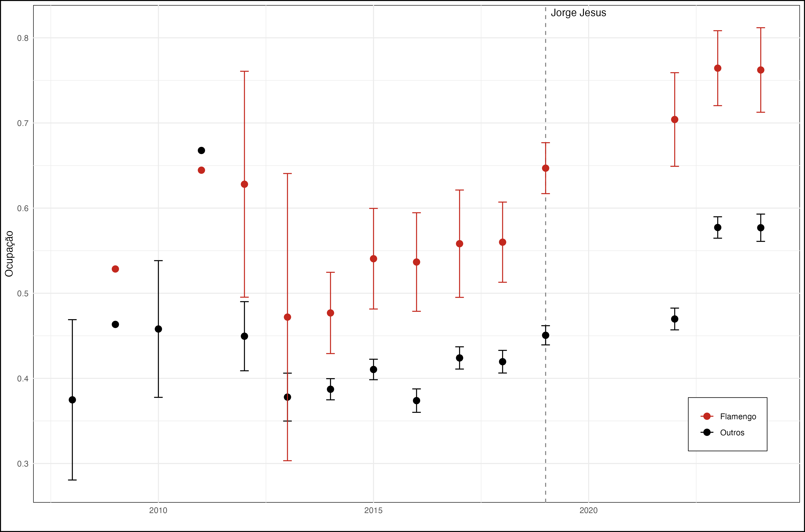
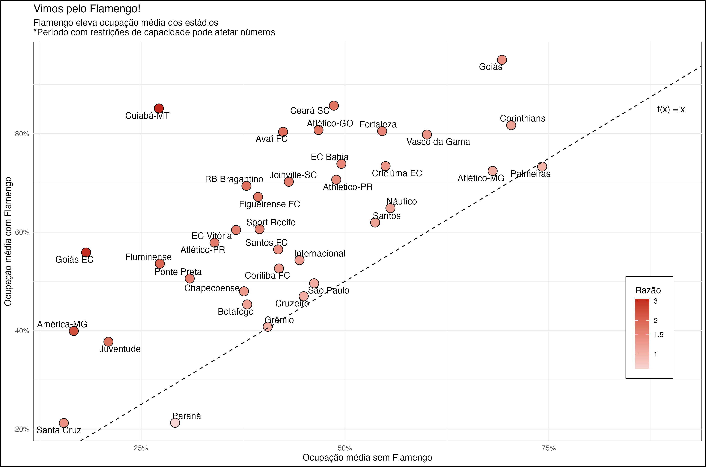

# attendance
Visualizing attendance in Flamengo's away matches

## Data
Thanks to [Base dos Dados](https://basedosdados.org/dataset/mundo-transfermarkt-competicoes)
 I could easily download data from 2018 onwards:
 
```
df <- basedosdados::read_sql("SELECT ano_campeonato, data, rodada, estadio,
                              publico, time_man, time_vis, colocacao_man,
                              publico_max, colocacao_vis
                             from basedosdados.mundo_transfermarkt_competicoes.
                             brasileirao_serie_a
                             WHERE ano_campeonato > 2017")
```

<p align = "center">

</p>


## Metrics

For each club $i$, I compute non-Flamengo attendance as the average attendance 
in their home matches which Flamengo is not the visiting team:

$$NonFlamengo_i =
\frac{\sum_{m \in Matches(i)} Attendance_{m}\mathbb{1}[Away(m) \neq Flamengo]}
{\sum_{m \in Matches(i)}\mathbb{1}[Away(m) \neq Flamengo]}$$

Likewise, Flamengo attendance is defined as the average attendance 
in their home matches which Flamengo is the visiting team:

$$Flamengo_i =
\frac{\sum_{m \in Matches(i)} Attendance_{m}\mathbb{1}[Away(m) = Flamengo]}
{\sum_{m \in Matches(i)}\mathbb{1}[Away(m) = Flamengo]}$$

Finally, ratio measures how greater is the attendance in Flamengo matches:

$$Ratio_i = \frac{Flamengo_i}{NonFlamengo_i}$$

**Important:** such period is influenced by the Covid-19 pandemics. I filtered 
out those matches with zero attendance, but others happened under public 
restrictions, mainly in 2021.

<p align = "center">

</p>

## Regression Analysis

In order to control for year ($t$) and home team specific effects, as well as both teams standings, consider the following regression setup:

$$Attendance_{m} = \beta_{0} + \sum_{t} \beta_{t}\mathbb{1}[Year_{m}=t] + \sum_{j}\beta_{j}\mathbb{1}[Home_{m} = j] + \beta_{Fla}\mathbb{1}[Away(m) = Flamengo] + \beta_{1}(1/StandingsHome_{m}) + \beta_{2}(1/StandingsAway_{m})$$

{{ include "regression_table.md" }}
